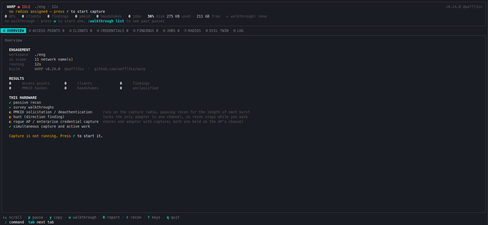
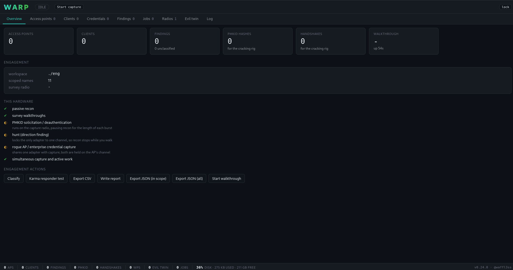

# WARP - Wireless Assessment & Rogue Platform

**v0.24.0** · Linux (Debian/Ubuntu/Kali), amd64 + arm64 · [@waffl3ss](https://github.com/waffl3ss)

> Built with [Claude Code](https://claude.com/claude-code). I started WARP myself, but the research
> and wiring-up of the nl80211 / EAP / WPS internals was taking a very long time, so I built it out
> with Claude doing the heavy lifting on the implementation and testing. The design decisions and the
> hardware validation are mine.

Single-binary tooling for **authorized** wireless security assessments conducted under signed
Statements of Work. Consolidates the airodump-ng → cap2hccapx → hashcat pipeline, enterprise
EAP work, and site survey into one Go daemon with thin clients.

No Python, no aircrack-ng, no hcxtools, no eaphammer at runtime. WARP does not crack - it
writes hash files for cracking on a separate rig.

---

## Screenshots

### Terminal dashboard (TUI)

The primary on-site interface: tabs for access points, clients, credentials, findings, jobs, radios,
the evil twin, and the log, with per-row attack keys.



### Browser interface (Web)

The same RPC surface in a hand-written, dependency-free page served on loopback by default.



---

## Install

Go 1.26+. Nothing else at build time.

```sh
git clone https://github.com/waffl3ss/warp && cd warp
make build            # → ./bin/warp and ./bin/warpd
sudo make install     # optional: /usr/local/bin
```

Static, `CGO_ENABLED=0`, so the binary runs on whatever is in the client's closet without
matching a glibc version. `make cross` produces linux/amd64 and linux/arm64.

```sh
./bin/warp --version
```

The version is compiled in from `internal/build`; the Makefile adds the git commit on top, so
`warp --version` reports both. A finding in a report traces back to the exact build that
produced it.

Root is needed only to reconfigure adapters - `warp radios probe` and every read-only
subcommand run unprivileged.

---

## Quick start

```sh
make build

# 1. Create an engagement from the client's ESSID list.
./bin/warp init ./engagement --scope /path/to/client-scope.txt

# 2. Start the daemon (needs root to reconfigure adapters).
#    The control socket defaults to /run/warp.sock; --web serves the browser interface too.
sudo ./bin/warpd --workspace ./engagement --web

# 3a. Open the browser interface, using the link warpd printed.
#     Or, against a daemon already running without --web:
./bin/warp web

# 3b. Or open the terminal dashboard. Same capabilities, no browser needed.
./bin/warp
```

## Two frontends, one daemon

Both drive the same engagement and neither can do anything the other cannot - they are
clients of one RPC surface, and no capability is exclusive to either.

| | Terminal dashboard | Browser interface |
|---|---|---|
| Start it | `warp` | `warpd --web`, or `warp web` |
| Needs | an SSH session | a browser and a port-forward |
| Use it when | you are on the box, or the link is down | you want filtering, sorting and detail side by side |

Neither holds engagement state. Close either one, lose the SSH session, kill the browser tab
- the daemon owns the radios and every running job, and nothing stops.

## The terminal dashboard

`warp` with no arguments opens it. Seven tabs, live, no commands to memorise. The build and handle sit at the right of the title line, faint - findable if you look for them, out of the way while you are working.

`PMF` is Protected Management Frames (802.11w) - `off` means any associated client can be
deauthenticated, `req` means none can. `◉` marks a hidden network whose name WARP recovered
anyway.

Point at a row and press a key - you never type a MAC address:

| Key | Does |
|---|---|
| `1`-`9` | switch tab (Overview, APs, Clients, Credentials, Findings, Jobs, Radios, Evil Twin, Log) |
| `g` `S` `X` | on the Evil Twin tab: generate a certificate, start the rogue, stop it |
| `l` `U` | on the Radios tab: pin an adapter to a channel, or unpin it |
| `radios reset <radio>` | on the Radios tab (browser) or the command prompt: USB-reset a wedged adapter live, capture stopped |
| `↑` `↓` | move the cursor |
| `enter` | full detail for the selected device, into the Log tab |
| `s` | solicit a PMKID from the selected access point |
| `d` | deauthenticate - broadcast from the AP tab, targeted from the Clients tab |
| `h` | hunt it, or stop hunting it - works out of scope, it only listens |
| `H` | stop every hunt |
| `a` | add this network's name to scope (recorded in the audit log) |
| `u` | decloak a hidden network - needs `scope confirm` on that BSSID first |
| `P` | WPS Pixie Dust: one exchange, PIN recovered offline |
| `C` | clone an enterprise network's RADIUS certificate, for the rogue to mimic |
| `x` | exclude it from active work (operator veto) |
| `m` | mark/unmark this BSSID as a potential rogue (this BSSID only; turns the name red) |
| `r` | start/stop recon |
| `c` | re-run rogue classification |
| `w` | start a walkthrough |
| `e` | regenerate the CSV projections |
| `:` | command prompt, with tab completion over discovered BSSIDs/ESSIDs/MACs |
| `o` / `O` | sort the current tab by the next column / reverse it |
| `p` | pause the display - capture keeps running, the screen stops moving |
| `y` | print the current tab as plain text so you can select and copy it |
| `v` | hide the detail pane for a wider listing, and back |
| `?` | the full key list, grouped by what each key acts on |
| `q` | detach - stops nothing, the daemon owns the radios and jobs |

The Overview tab answers the questions you actually have on arrival: is it capturing, what
has it found, what is blocked, and **what this hardware can and cannot do**.

## The browser interface

Fully capable, not a read-only view: it starts and stops capture, solicits PMKIDs,
deauthenticates named clients, hunts, classifies, exports and writes the report. Tables sort
and filter, and selecting a row opens a detail panel beside it with the evidence behind every
conclusion.

```sh
# Started with the daemon:
sudo ./bin/warpd --workspace ./engagement --web

# Or attached to one already running, without restarting it -
# restarting warpd releases the radios and kills running jobs.
./bin/warp web
```

Either prints the URL and a one-time access token:

```
web interface:  https://127.0.0.1:8443/?token=Yb3n_9Qx…
access token:   Yb3n_9Qx…
```

The link logs you in. Because the interface can transmit:

- It **binds loopback only** by default (`127.0.0.1:8443`), so `--web` on its own is reachable
  only from the box itself. Reach it over an SSH port-forward (`ssh -L 8443:127.0.0.1:8443
  eng-box`) - that is the recommended path. To bind a
  network-reachable address instead you must pass **both** the address and the opt-in:
  `--web-listen 0.0.0.0:8443 --web-allow-remote` (`--listen` / `--allow-remote` on `warp web`).
  Binding a non-loopback address without `--web-allow-remote` is refused, because this interface
  transmits.
- It is **served over TLS** with a certificate generated at startup and never written to
  disk. The browser warns once; nothing on the box claims a real identity. `--web-no-tls`
  exists for the port-forward case.
- The **token is new for every run**. It is printed at startup and also written, with the URL and
  listen address, to `web-access.txt` in the engagement directory (0600), so a closet box reached
  over a VPN is retrievable without watching the console. Restarting invalidates the old token and
  rewrites the file.
- Mutating routes require POST, the CSP forbids everything the page does not embed, and the
  session cookie is `HttpOnly` and `SameSite=Strict`.

None of that bypasses the scope gate. A refusal over HTTP is the same refusal the console
gets, rendered as a refusal - `403`, with the reason - rather than as a failure to debug.

## Scripting

Everything either frontend does is also a subcommand, because all three speak the same
RPC surface - nothing is interactive-only. Add `--json` to any of them:

```sh
./bin/warp aps --json | jq '.[] | select(.in_scope)'
./bin/warp clients --json
./bin/warp psk a4:2b:8c:11:22:33
./bin/warp hashes                      # what has been captured
./bin/warp hashes --lines > job.22000   # straight to the cracking rig
./bin/warp rogue classify && ./bin/warp rogue list
./bin/warp report
```

The web interface exposes the same surface over HTTP, so it is scriptable from a machine that
cannot reach the Unix socket. Every route maps onto an RPC method; reads are `GET`, anything
that transmits or changes state is `POST`:

```sh
curl -sk -H "Authorization: Bearer $TOKEN" https://127.0.0.1:8443/api/aps | jq
curl -sk -H "Authorization: Bearer $TOKEN" -X POST \
     -d '{"bssid":"a4:2b:8c:11:22:33"}' https://127.0.0.1:8443/api/psk/solicit
```

## What actually gets captured

Two things go to the cracking rig, and they are both **WPA-Personal**:

| Shown as | File | What it is | hashcat |
|---|---|---|---|
| `PMKID` | `pmkid.22000` | The PMKID from message 1. No client involvement at all - this is why `warp psk <bssid>` is the fastest thing on an engagement. | 22000, `WPA*01` |
| `HANDSHAKE` | `handshakes.22000` | A full WPA/WPA2/WPA3-Personal four-way handshake. Needs a client to join, which is what deauthenticating one is for. | 22000, `WPA*02` |

Both crack the same way against the same wordlist.

**Enterprise authentication is not in these files.** WPA-Enterprise credentials come from the
RADIUS server as MSCHAPv2 (hashcat `-m 5500`) into `creds/`. WARP never mixes the two: the
handshake parser accepts only EAPOL-Key frames (802.1X packet type 3) and rejects EAP-Packet
(type 0) outright.

## How many adapters do I need?

**One is enough.** WARP runs fully on a single adapter - active work borrows the capture
radio for the length of each burst, so recon pauses for a moment rather than anything being
unavailable. A second adapter removes those pauses and lets survey stay pinned to its own
radio for the whole engagement.

The Overview tab and `warp radios probe` both tell you exactly what the hardware in front of
you can do, before you are on site:

```
✓ passive recon
✓ survey walkthroughs
~ PMKID solicitation / deauthentication   runs on the capture radio, pausing recon per burst
~ hunt (direction finding)                locks the only adapter, so recon stops while you walk
✗ rogue AP / enterprise credential capture   no adapter supports AP mode
```

---

## Scope model in one paragraph

The client provides `scope.txt`, a newline-delimited list of ESSIDs. That list **is** the
authorization, because it is exactly what a Statement of Work grants. Any BSSID broadcasting a scoped
ESSID is authorized for active work; anything else is passive observation only.
BSSIDs are always discovered off the air and never configured - there is no input file, flag
or struct field anywhere that accepts one as scope.

`scope confirm <bssid>` records an operator sanity check. It is advisory and never a
precondition: a testing device in a wiring closet has nobody to confirm anything and does identical work.

Generic scoped names (`Guest`, `linksys`, `attwifi`, …) are flagged at `init`, because a
neighbour can legitimately broadcast the same name. Each requires an explicit acknowledgment
that is written to the audit log; that acknowledgment is workspace state made once before the
box ships, not a runtime prompt.

**Matching ignores case, and nothing else.** scope.txt is typed by a human from a signed
document, so an SoW saying `Acme-Corp` still authorizes a beacon saying `ACME-CORP`. That is
the only latitude: whitespace, padding, substrings and Unicode lookalikes all stay out of
scope, because a homoglyph ESSID is an attack rather than a typo. Every authorization records
whether the match was byte-exact, and a network matching only after folding raises a finding -
an access point named `CORP-WIFI` beside the estate's `Corp-WiFi` is the cheapest
impersonation there is.

**Passive work is never gated on scope.** Hunting only listens, so it works on any device WARP
has seen. Walking down a transmitter nobody can account for is the whole point of rogue
hunting, and that device is exactly the one that will never be in `scope.txt`.

The same goes for handshakes: WARP listens continuously and records **every** one it hears,
including from networks the engagement has no authority over - a frame is heard once, and
dropping it means the operator never learns it existed. What scope decides is where it goes.
In-scope captures are the deliverable (`pmkid.22000`, `handshakes.22000`); anything else is filed
as incidental in `out-of-scope-*.22000`, labelled as such in every frontend, excluded from the
engagement's hash counts, and excluded from `warp hashes --lines`. The prefix is deliberate:
`*.22000` collecting the deliverable will not sweep it up, because cracking a neighbour's
handshake is unauthorized work.

Findings follow the same rule. Posture - open, WEP, TKIP, WPS, 802.11w, transition mode - is read
off every observed network, in scope or not, because observing it is not transmitting. Each finding
is filed by scope, not thrown away: `findings.csv` holds all of them, `findings-in-scope.csv` holds
only those on a scoped network (the file for reporting), the report keeps its deliverable totals to
in-scope findings with an *Out of scope (context)* section for the rest, and the findings tab has an
**in scope only** toggle. A configuration that is correct or a test the network passed - 802.11w
required, WPS locked, an AP that resisted Pixie Dust - is filed as a `control`, shown apart from the
exposures so a pass never reads as a problem.

Most findings WARP derives itself - including **PSK access point on an otherwise enterprise ESSID**,
where one BSSID serves a name over a pre-shared key while others on it use 802.1X (the shape of a
misconfiguration or an impostor a client would still trust). Two are not simple derivations:
**evil twin candidate** (a fingerprint outlier within a scoped ESSID's population, always hedged and
shown with the diverging attributes) is an inference, and **Potentially Rogue Device** is applied
only by the operator - `m` on the console,
**Mark Rogue Device** in the browser, or `warp rogue mark <bssid>`. It marks one BSSID (never the
whole ESSID), turns the name red, and records an evidence-tier finding whose evidence field is a
plain "manual evidence required" placeholder for you to fill in. Because a suspected rogue is by
nature not on a scoped network, it stays in the in-scope views rather than being filed away as
out-of-scope context. Findings carry their evidence by type: a beacon-security parse for a posture
finding, the recovered name for a decloak, the probe response for a karma responder, the diverging
attributes for an evil-twin candidate, and the manual placeholder for an operator-marked rogue -
never a cipher dump where it does not belong.

Scope can be widened and narrowed from any interface: `scope add <essid>` and `scope remove <essid>`
edit the list (persisted to `scope.txt`, recorded in the audit log), and only names WARP has
actually observed can be added - scope names things off the air, it never invents them.

### When the SoW covers a site rather than a list

```sh
./bin/warp init ./engagement --all-networks \
  --justification "SoW 123456789, all wireless at client location"
```

Every *named* network becomes authorized for active work. It exists for an SoW written that
way - a standalone warehouse, a campus whose airspace you control - and not as a way around a
scope file: WARP cannot tell the client's networks from a neighbour's, so on a shared floor
this will transmit at equipment belonging to someone who never signed anything.

It is recorded at init, not toggled at runtime. The written justification is required, travels
with every transmission in `events.jsonl`, and both frontends keep a red banner on screen for
the life of the engagement. An unresolved hidden network is still passive-only - there is no
name to authorize - and an operator veto still narrows scope.

---

## Command reference

Everything is also available in both interfaces; nothing is subcommand-only or dashboard-only.

| Command | Does |
|---|---|
| `warp` | Open the terminal dashboard (or say how to start a daemon if none is running) |
| `warp web` | Serve the browser interface against a running daemon |
| `warp init <dir> --scope <file>` | Create an engagement directory from the client's ESSID list |
| `warp init <dir> --all-networks` | Create one scoped to every network at a site (needs a written justification) |
| `warpd --workspace <dir>` | Run the daemon. Add `--web` to serve the browser interface too |
| `warp radios probe [--inject]` | Enumerate adapters; `--inject` tests injection empirically (root) |
| `warp radios lock <radio> <ch>` | Pin an adapter to a channel instead of letting it sweep |
| `warp radios unlock [radio]` | Hand it back to the channel plan |
| `warp radios reset <radio>` | USB-reset a wedged adapter: live if warpd is running (capture stopped), standalone if not |
| `warp status` | Daemon and engagement state |
| `warp recon start` / `stop` | Acquire radios and begin capture, or release them |
| `warp aps [--scoped]` | Observed access points |
| `warp clients` | Observed client devices, with the network each is on |
| `warp hashes [--lines]` | Captured PMKIDs and handshakes; `--lines` pipes to the cracking rig |
| `warp psk <bssid>` | Solicit a PMKID (default), or `--deauth --station <mac>` to force a handshake; `--count`/`--seconds` size the deauth campaign |
| `warp decloak <bssid>` | Recover a hidden network's name (needs `scope confirm` on that BSSID) |
| `warp wps <bssid>` | One WPS exchange, PIN recovered offline (Pixie Dust). No online brute force |
| `warp hunt <bssid\|mac>` | Direction-find a device - works out of scope, it only listens |
| `warp eap harvest <bssid>` | Read the RADIUS server's certificate off the air, for the rogue to mimic |
| `warp eap cert list` | The certificate library: what each network could present, and what it will |
| `warp eap cert generate <essid>` | Build a certificate from fields you supply (the certwizard equivalent) |
| `warp eap cert import <essid>` | Import a certificate and key made elsewhere |
| `warp eap cert select <essid> <id>` | Choose which certificate goes on the air |
| `warp eap start <essid>` | Impersonate a scoped enterprise network and capture credentials |
| `warp eap status` / `stop` | What has been captured; tear it down |
| `warp rogue classify` / `list` | Re-run classification, list findings |
| `warp rogue karma-test` | Probe for a network that cannot exist; record what answers |
| `warp rogue mark` / `unmark <bssid>` | Flag/clear one BSSID as a potential rogue (operator judgement; manual evidence) |
| `warp scope list` / `confirm` / `reject` | Inspect scope, annotate a BSSID, exclude one from active work |
| `warp scope add` / `remove <essid>` | Widen or narrow the ESSID scope (persisted; only observed names can be added) |
| `warp walkthrough [name]` | Tag observations with where you are |
| `warp localize <addr>` | Rank the walkthroughs where a device was heard loudest |
| `warp jobs` / `jobs kill <id>` | Background jobs |
| `warp export` | Regenerate the CSV projections |
| `warp report [--stdout]` | Write the engagement report (Markdown) |
| `warp report export [--scoped]` | Write the machine-readable JSON report (all + in-scope; no secrets) |

Add `--json` to any read command for machine-readable output.

## Engagement directory

One engagement is one directory, and it is the deliverable that gets archived.

```
engagement/
  scope.txt                        the client's ESSID list, copied in
  site-wide-scope.txt              present only for --all-networks; the written justification
  events.jsonl                     append-only audit log - every authorization, allow and deny
  warp.db                          sqlite; authoritative
  pmkid.22000                      ── for the cracking rig
  handshakes.22000                 ──
  out-of-scope-pmkid.22000         incidental captures; NOT part of the deliverable
  out-of-scope-handshakes.22000
  report.md                        written by `warp report`
  report.json report-in-scope.json machine-readable report (BSSID-to-ESSID map + findings; no secrets)
  web-access.txt                   the web URL, access token and listen address (0600; --web only)
  bssids.csv clients.csv           regenerated projections
  observations.csv                 appended live, one row per frame heard
  findings.csv                     every finding; findings-in-scope.csv is the reporting subset
  rogues.csv walkthroughs.csv
  networks.netxml                  Kismet-style view of the observed networks, regenerated live
  captures/                        capture-<UTC>.pcapng + .netxml, one pair per recon start/stop
  walkthroughs/                    <name>-<id>.pcapng + .netxml + .txt roll, one per pass
  creds/                           mschapv2.5500 (hashcat -m 5500), cleartext.txt (TTLS-PAP/GTC
                                   passwords, no cracking), wps-keys.txt, and a credentials.txt
                                   summary rewritten as each one lands
  certs/<essid>/harvested.pem      the target's real RADIUS certificate, read off the air
  certs/<essid>/harvested.json     its fields, for the report
```

Everything is `0700`/`0600`: the directory holds credential material and a record of everything
transmitted at a client site.

---

## Building

```sh
make build     # ./bin/warp and ./bin/warpd
make cross     # linux/amd64 + linux/arm64 static binaries
```

The version is a constant in `internal/build/build.go`; the Makefile injects the git commit at link
time, so `warp --version` reports both and a finding traces back to the exact build that produced it.

---

## Legal

WARP is for authorized testing only. It transmits - soliciting PMKIDs, deauthenticating
stations, and running an access point - and every one of those actions is gated on the client's
ESSID list. `events.jsonl` records every authorization decision, allow and deny, and is the
evidence that what was transmitted matched what was signed. Do not run it against networks you
do not have written authorization to test.
